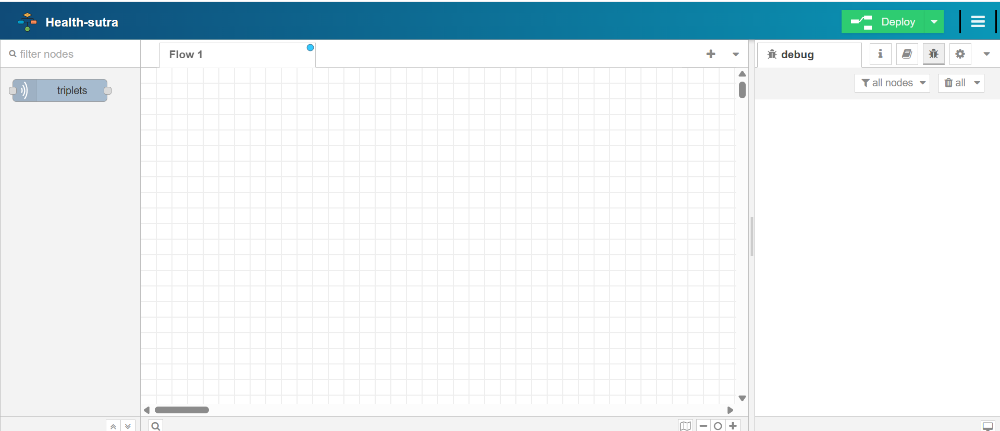
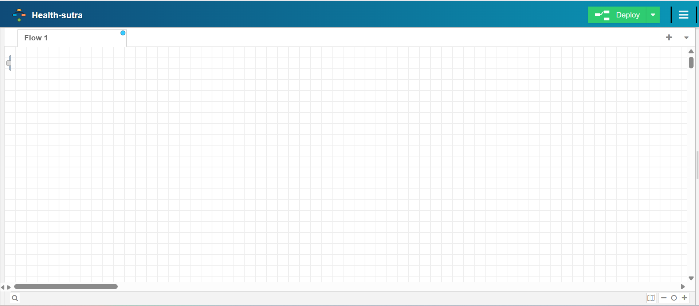
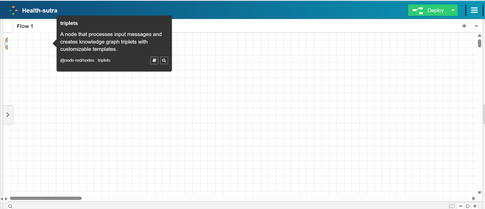
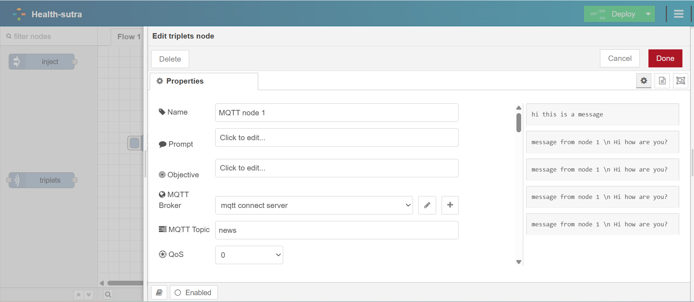
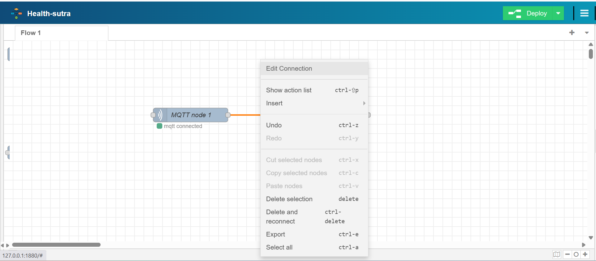
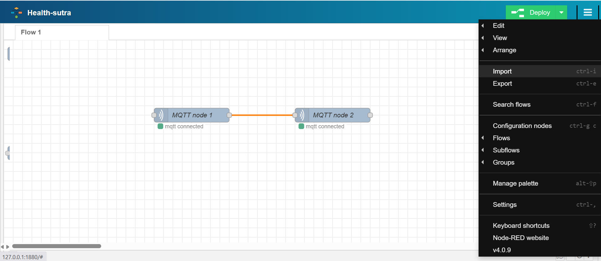

## How to setup

1. step 1:  
git clone https://github.com/Suetra-ai/work-flow.git

2. step 2:  
cd work-flow

3. step 3:  
npm install

4. step 4:  
npm run build

5. step 5:  
npm start

step 1 to step 4 is one time setup. For running it each time use only step 5.

## How to use this tool?

In left sidebar you can find the triplets node.  
In right sidebar there is a global debuger.

Drag and drop the triplet node in the editor.
You can collapse both the left and right debugger.

You can drag and drop like this also.  

Click on the nodes to open propertysheet.  
  
In the propertysheet right side is node level debugger.

For giving edge condition click on the connection then do right click then click edit connection. 

For import and exporting the flows you can click on the top right menu and select import/export.  

## Importent :
All the importent json file is saved in 
path: public\data  
doxigen_data.json -- contains allthe python tools.  
history.json -- contains all the node outputs based on node id.  
triplets_data.json -- contains all the entity and relations of triplets.  

You can modify the json files according to your needs.

In the root directory , flows.json contains all the flows made in editor.  
path: flows.json

